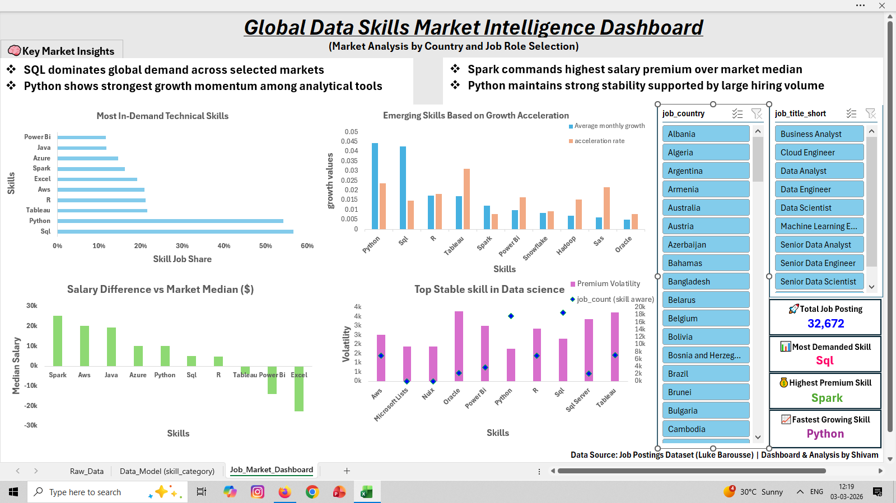
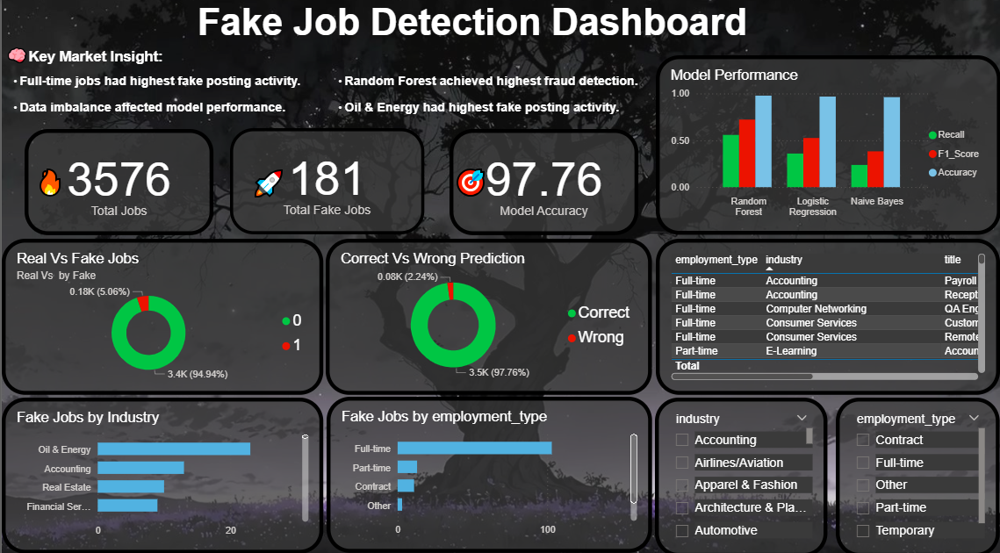

# Hi 👋, I'm Shivam Yadav

  

## 🚀 Aspiring Data Analyst | Machine Learning Enthusiast

🎓 B.Sc Data Science Graduate  
📊 Skilled in Excel, SQL, Python & Power BI  
🤖 Interested in Machine Learning & Analytics  
📍 Mumbai, India

## 🛠️ Tech Stack

---

## 🌐 Connect With Me

---

## 🛠️ Skills

- Excel
- SQL
- Python
- Power BI
- Machine Learning
- Data Cleaning
- Data Visualization

---

## 📂 Featured Projects

### 📊 Global Data Skills Market Intelligence Dashboard
- Excel Dashboard Project
- Power Pivot + KPI Analysis
- Market trend analysis
- 

### 🤖 Fake Job Posting Detection
- NLP + Machine Learning Project
- Logistic Regression, Naive Bayes, Random Forest
- Interactive Power BI Dashboard
- 

---

## Education
- Bachelors in Data-Science (Chandrabhan Sharma College of Arts, Science and Commerce)(8.03/10)

---

## 📫 Connect With Me

- LinkedIn: https://www.linkedin.com/in/shivam-yadav-7993a42a5/
- GitHub: https://github.com/Shivam-data-analytics
- E-mail: sy49067@gmail.com
- Phone: +91 7400353445

---
## 📈 Currently Learning

- Advanced Power BI
- Machine Learning
- Data Analytics Projects

---

